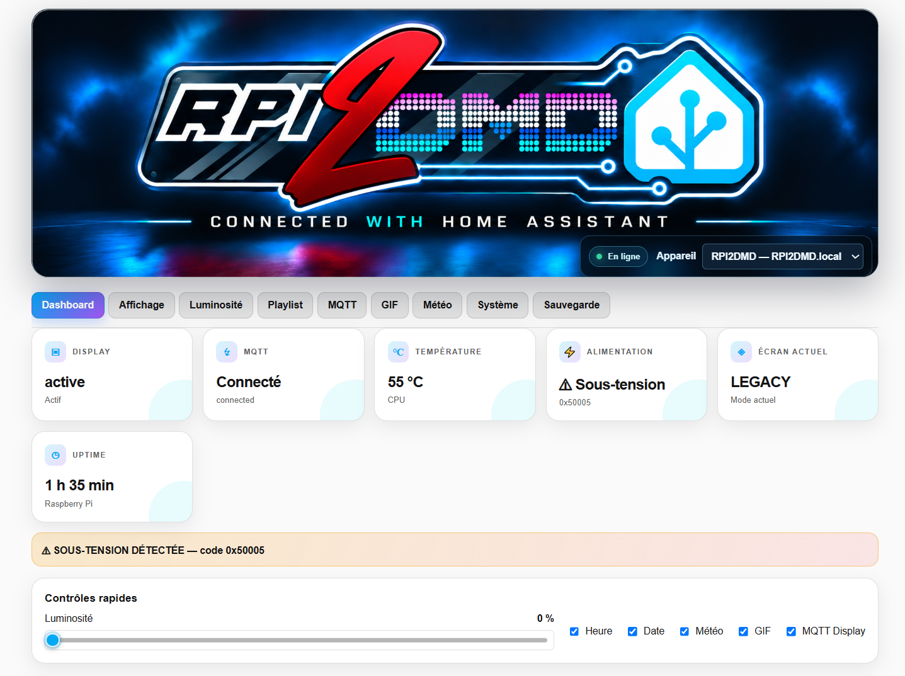
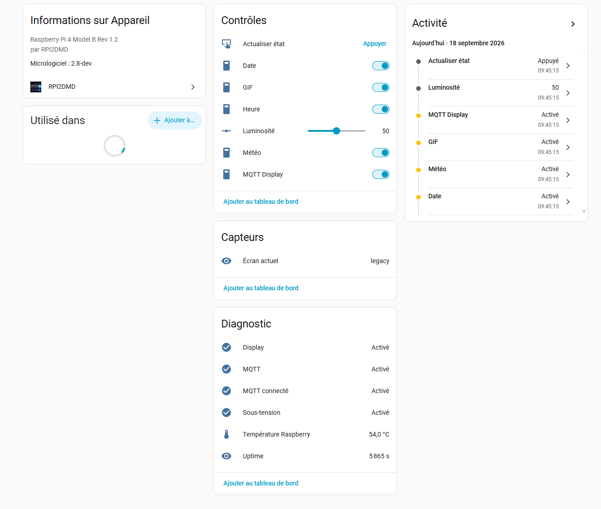
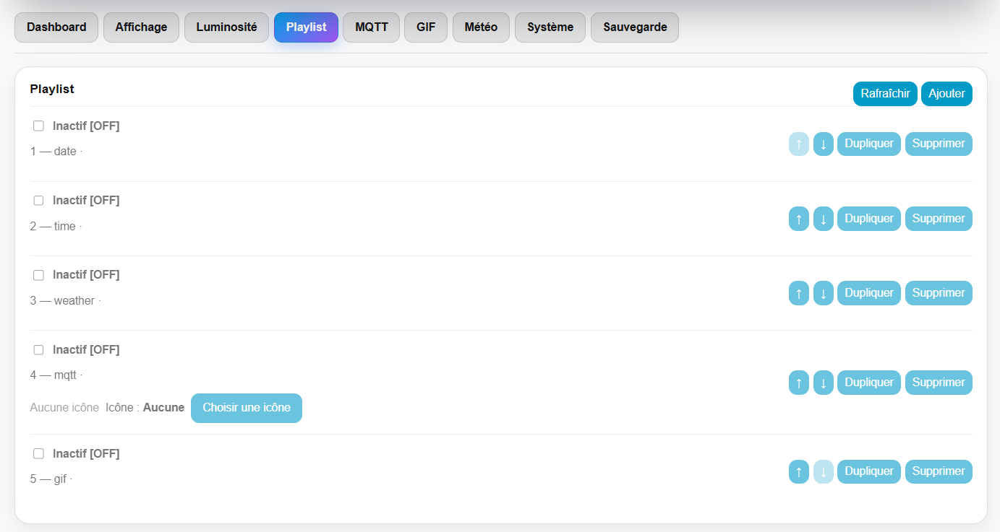
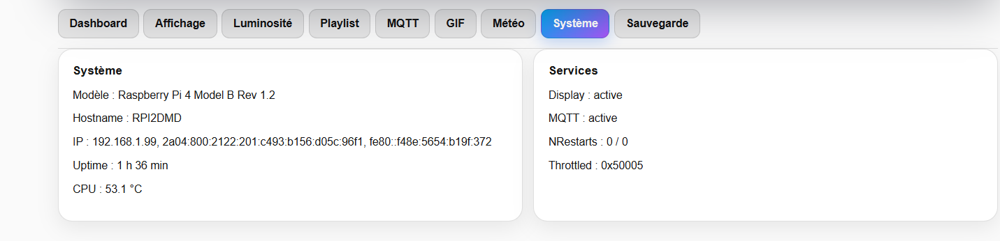
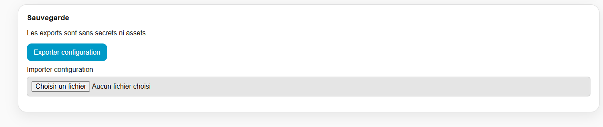
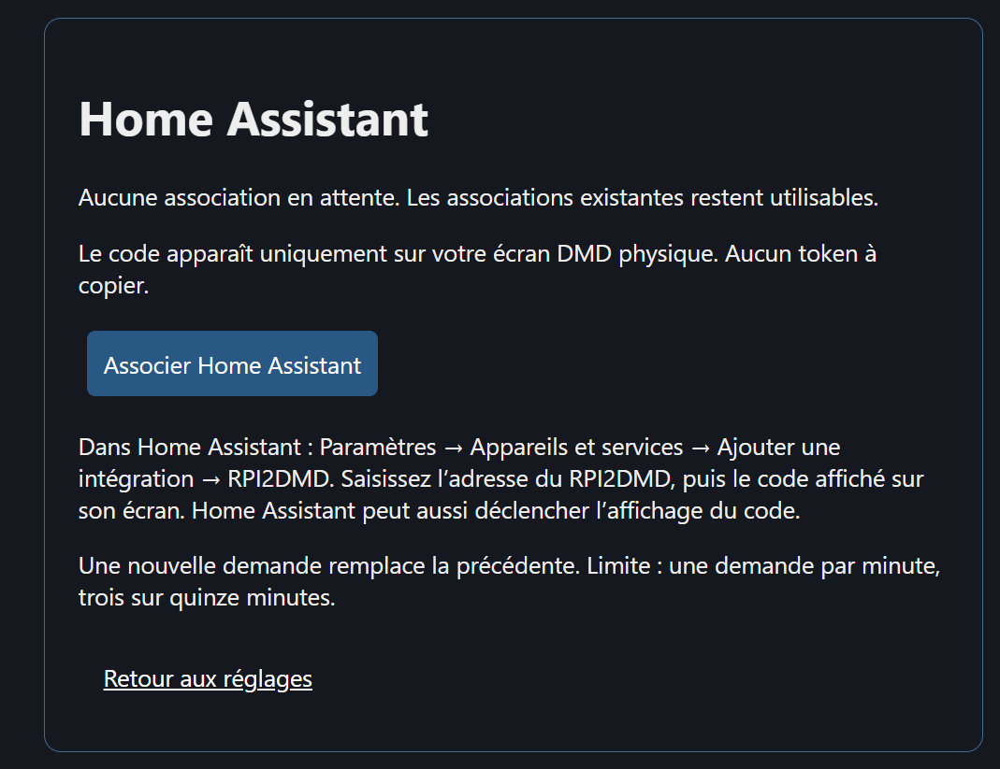
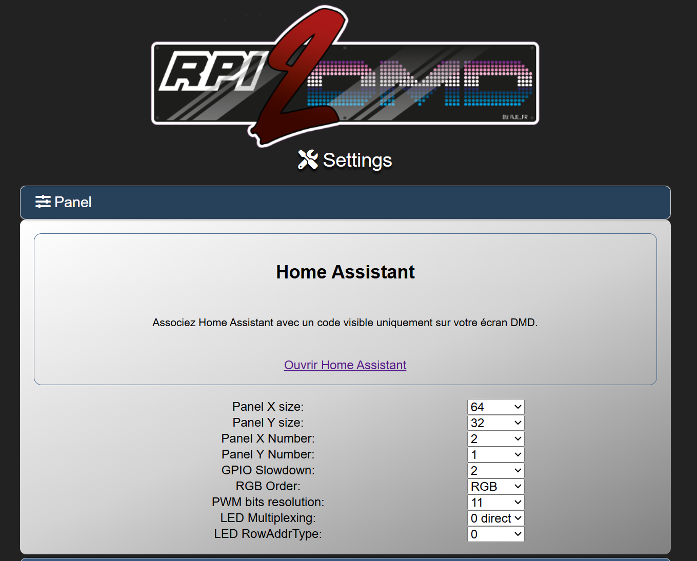

# RPI2DMD pour Home Assistant


Cette intégration permet de contrôler un RPI2DMD directement depuis Home
Assistant. Le Raspberry reste autonome et Home Assistant utilise son API
locale pour lire l'état et envoyer les commandes.

## À quoi sert ce projet ?

RPI2DMD est un afficheur DMD piloté par un Raspberry Pi. L'intégration
Home Assistant permet notamment de :

- surveiller l'affichage et la connexion MQTT ;
- consulter la température, l'uptime et les diagnostics d'alimentation ;
- régler la luminosité et son planning horaire ;
- activer ou désactiver l'heure, la date, la météo, les GIF et MQTT ;
- gérer la playlist et ses lignes ;
- gérer les catégories de GIF ;
- configurer MQTT et la météo ;
- exporter ou importer la configuration lorsque l'API le permet.

## Comment ça fonctionne ?

```text
Home Assistant
      ↓
Intégration RPI2DMD
      ↓  API HTTP locale
RPI2DMD V2.8 sur Raspberry Pi
      ↓
Panneau DMD
```

La communication reste sur le réseau local : aucun cloud n'est nécessaire.
Le navigateur Home Assistant parle au backend de l'intégration par
WebSocket ; il ne contacte jamais directement le Raspberry et ne reçoit pas
le token API.

## Fonctionnalités

### Dashboard

- état Display et MQTT ;
- température CPU ;
- alimentation, sous-tension et throttling ;
- uptime ;
- écran actuellement affiché.

### Affichage

Les réglages d'affichage exposés par l'API RPI2DMD sont accessibles depuis
le panel, avec les commandes rapides pour l'heure, la date, la météo, les GIF
et MQTT Display.

### Luminosité

- réglage manuel ;
- planning par points horaires ;
- activation, désactivation et application immédiate du planning.

### Playlist

- ajout et modification de lignes ;
- activation/désactivation ;
- déplacement, duplication et suppression ;
- conservation de l'ordre et des types RPI2DMD.

### MQTT

- configuration du broker, du port, du compte et du client ;
- état de connexion ;
- test de connexion lorsque l'API le propose.

Le mot de passe existant n'est jamais affiché.

### GIF

- catégories et nombre de GIF ;
- activation/désactivation des catégories ;
- consultation des métadonnées disponibles.

### Météo

- réglages de localisation et d'unité ;
- activation et options météo ;
- configuration de la clé OpenWeatherMap sans exposer la clé existante.

### Système

- modèle Raspberry, hostname et adresses réseau ;
- version RPI2DMD et état des services ;
- température, mémoire, stockage, uptime et diagnostics d'alimentation.

### Sauvegarde

Le panel propose l'export et l'import de configuration selon les capacités
de l'API. Les secrets système et les assets ne sont pas inclus.

## Installation

1. Ouvrir **HACS** dans Home Assistant.
2. Ajouter ce dépôt comme dépôt personnalisé, de type **Integration**.
3. Installer **RPI2DMD**.
4. Redémarrer Home Assistant.
5. Aller dans **Paramètres → Appareils et services → Ajouter une intégration**.
6. Rechercher **RPI2DMD**.

Un RPI2DMD V2.8 avec son API activée est nécessaire.

## Configuration

Home Assistant découvre automatiquement le service `_rpi2dmd._tcp.local.`.
Confirmez l’appareil découvert pour demander un code sur le DMD physique, puis
saisissez ses six chiffres. L’identité est vérifiée par `/api/v1/info`, et non
par le seul TXT mDNS. Une nouvelle adresse du même appareil met à jour son entrée.

L’ajout manuel reste disponible : saisissez une IPv4, un hostname ou une IPv6
(avec ou sans crochets), puis utilisez le même code physique.

Cette branche nécessite l'image V28 PAIRING. Le code reste valable cinq minutes,
pour un seul échange, avec cinq erreurs maximum. Il n'est jamais affiché dans
le Web RPI2DMD. Aucun mot de passe Web, SSH ou token à copier n'est nécessaire.
Si le code expire, sélectionnez « Demander un nouveau code » dans le formulaire,
puis confirmez. Aucune nouvelle demande n’est envoyée automatiquement. Les demandes sont limitées
à une par minute et trois sur quinze minutes ; un code déjà actif est réutilisé.

Exemple de format d'adresse : `192.168.x.x`.

Le token est stocké dans l'entrée de configuration Home Assistant. Il n'est
pas affiché dans le panel, les entités ou le dépôt GitHub.

Les installations existantes avec un token continuent à charger sans migration
ni nouvel appairage. Si le Raspberry refuse le token, Home Assistant propose une
réauthentification par code physique qui met à jour la même entrée et conserve
l’identité de l’appareil. Le firmware peut retourner un session_id au démarrage,
mais l’échange conserve son contrat actuel : seul le code est envoyé.

Le Web RPI2DMD reste ouvert sur le LAN. Un client peut demander l'affichage d'un
code, mais les réponses publiques ne donnent ni ce code ni le token. L'accès visuel
au DMD est la preuve attendue ; des devinettes restent possibles dans la limite
des cinq essais. L'API HTTP existante n'est pas chiffrée : un observateur du trafic
de pairing pourrait intercepter le code ou le token. Cette phase suppose un LAN
de confiance ; elle n'apporte pas de protection TLS contre l'écoute ou le MITM.

## Interface Home Assistant

L'installation ajoute à la fois :

- un appareil Home Assistant classique avec ses capteurs, switches et
  contrôles ;
- une application **RPI2DMD** dans la barre latérale.

Le panel permet les opérations normales depuis une interface graphique,
sans utiliser SSH ou PuTTY.

## Sécurité

- l'API RPI2DMD est protégée par un token ;
- le token reste côté backend Home Assistant ;
- le mot de passe MQTT existant n'est jamais renvoyé au navigateur ;
- les échanges sont locaux ;
- aucun secret n'est stocké dans ce dépôt.

## Compatibilité

- RPI2DMD V2.8 : requis ; pas encore diffusé
- Home Assistant : custom integration installable via HACS ;
- Raspberry Pi 4 : testé physiquement ;
- Raspberry Pi Zero 2 W : fonctionnement RPI2DMD qualifié ;
- autres modèles : non garantis, à confirmer.


## État du projet

**Version actuelle : 0.4.5**

L’intégration RPI2DMD pour Home Assistant est désormais fonctionnelle pour les principales fonctions de configuration, de supervision et de pilotage du panneau RPI2DMD.

### Découverte et identification du RPI2DMD

Depuis la version 0.4.0, l’intégration prend en charge :

- la découverte automatique du RPI2DMD via Zeroconf (`_rpi2dmd._tcp.local.`) ;
- le pairing physique sécurisé par code à six chiffres ;
- la réauthentification depuis Home Assistant ;
- une identité matérielle stable basée sur `instance_id` ;
- la conservation de cette identité lors d’un changement d’adresse IP ;
- la préférence automatique pour `RPI2DMD.local`, puis IPv4 et IPv6 ;
- la récupération des entités déjà existantes afin d’éviter les doublons et de conserver leurs `unique_id`.

Les migrations de configuration et du planning de luminosité sont conçues pour rester idempotentes afin qu’une mise à jour de l’intégration ne recrée pas inutilement les entités.

### Interface Home Assistant

Le RPI2DMD dispose d’un panneau Home Assistant dédié permettant notamment de gérer :

- l’état général du panneau ;
- l’affichage ;
- la luminosité et sa programmation horaire ;
- la playlist ;
- les messages MQTT ;
- les GIF et leurs catégories ;
- la météo ;
- les informations système ;
- l’export et l’import de configuration.

Les échanges avec le Raspberry Pi passent par le backend Home Assistant : les informations sensibles telles que le mot de passe MQTT ou la clé API du RPI2DMD ne sont pas envoyées directement au navigateur.

### Playlist et stabilité des modifications

Les versions 0.4.2 à 0.4.5 améliorent fortement la gestion des modifications de playlist.

L’intégration sait maintenant gérer les conflits temporaires renvoyés par le RPI2DMD lorsque sa configuration est momentanément occupée (`409 Configuration is busy`).

Dans ce cas :

- les conflits temporaires sont retentés de manière contrôlée ;
- le nombre de tentatives reste limité ;
- aucun retry agressif n’est effectué sur les erreurs réseau ambiguës ;
- l’objectif est d’éviter les doubles modifications ou les écritures involontaires.

Cette logique améliore notamment la stabilité lors de l’ajout, de la modification, du déplacement ou de la suppression d’éléments dans la playlist.

### Sélecteur d’icônes MQTT

Le sélecteur d’icônes a été optimisé afin d’éviter de saturer le Raspberry Pi lors de l’ouverture de la bibliothèque.

Depuis la version 0.4.5 :

- une seule preview d’icône est chargée simultanément ;
- un délai est appliqué entre les chargements ;
- un backoff temporaire est utilisé lors d’erreurs `502`, `503`, timeout ou problème de connexion ;
- seules les premières icônes utiles sont chargées initialement ;
- les previews des icônes MQTT déjà utilisées sont prioritaires ;
- les requêtes devenues inutiles sont annulées lors d’un changement de filtre, d’appareil ou de la fermeture du sélecteur ;
- les previews déjà récupérées sont conservées en cache.

Ces optimisations réduisent fortement les rafales de requêtes vers l’API du RPI2DMD.

### Gestion du cache frontend

Depuis la version 0.4.5, le module JavaScript du panneau Home Assistant utilise une URL versionnée :

`/rpi2dmd-panel.js?v=0.4.5`

Cela permet d’éviter qu’un navigateur continue à utiliser une ancienne version de l’interface après une mise à jour de l’intégration.

La version du frontend réellement chargée est également visible directement dans l’interface :

`Interface HA : 0.4.5`

Un message de diagnostic est aussi affiché dans la console du navigateur :

`[RPI2DMD] frontend 0.4.5 loaded`

Cela facilite fortement le diagnostic des problèmes de cache entre plusieurs navigateurs ou sessions Home Assistant.

### Diagnostic API

Les dernières versions ajoutent également des informations de diagnostic supplémentaires concernant les échanges entre Home Assistant et le RPI2DMD.

Les journaux permettent notamment d’identifier plus facilement :

- la méthode HTTP utilisée ;
- le chemin API concerné ;
- le code HTTP retourné ;
- les réponses JSON invalides ;
- les erreurs temporaires `409`, `502` et `503`.

Les données sensibles sont masquées et aucun secret n’est ajouté aux journaux de diagnostic.

### Compatibilité et qualification

Cible de qualification actuelle :

- **Home Assistant Core 2026.9.2**
- **Python 3.14.2 ou supérieur**
- **RPI2DMD V2.8**
- **Raspberry Pi 4 : testé physiquement**
- **Raspberry Pi Zero 2 W : cible de fonctionnement RPI2DMD**

Voir `tests/requirements-ha8.txt` et le rapport HA8 pour les résultats de qualification.

L’action GitHub historique de référence reste basée sur Home Assistant **2024.12.5**.

Les fonctions principales de l’intégration et du panneau Home Assistant sont opérationnelles. Les améliorations actuelles portent principalement sur la robustesse des échanges avec le RPI2DMD, la gestion des accès concurrents et l’optimisation de l’interface.

## Aperçu de l’interface

### Page d'accueil



### Application



### Liste de diffusion



### État du système



### Sauvegarde



### Appairage



### RPI2DMD



